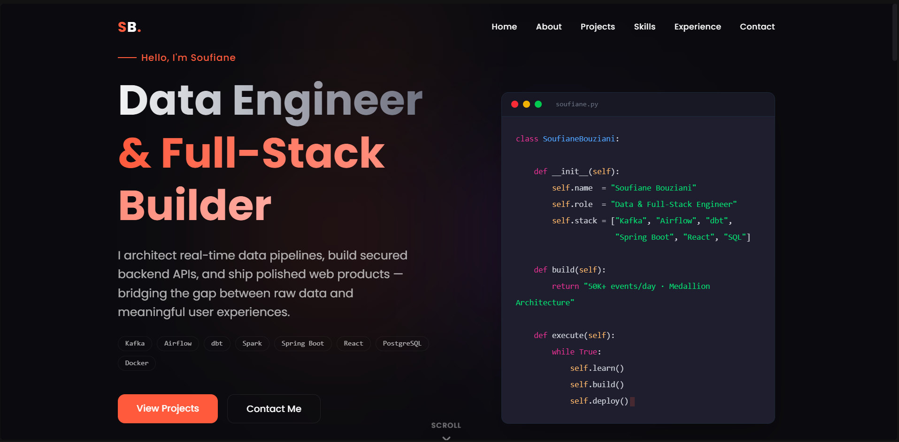

# Soufiane Bouziani - Developer Portfolio

A modern, minimal, and highly interactive developer portfolio built with **React**, **TypeScript**, **Tailwind CSS**, and **Framer Motion**. Designed specifically to showcase my journey, projects, and skills as a Data & Full-Stack Engineering student at ENSA Al Hoceima.



## ✨ Features

- **Modern 2025 Aesthetics**: Deep dark theme (`#0b0b0f`), glassmorphism cards, and a vibrant soft-orange accent (`#ff5a3c`).
- **Smooth Animations**: Powered by `framer-motion` for page loads, scroll reveals, and interactive hover states.
- **Dynamic Hero Section**: Features an animated "typing" terminal window executing a Python script of my skills.
- **Categorized Projects & Skills**: Filterable project cards with tech badges, and grouped skill sections (Data Engineering, Backend & Frontend, Databases & Tools).
- **Interactive Timeline**: A "My Journey" section documenting my educational and professional path.
- **Custom Cursor Glow**: A subtle, responsive radial gradient tracking the mouse pointer globally across the app.
- **Fully Responsive**: Mobile-first design perfectly adapted for all screen sizes.
- **Working Contact Form**: Pre-configured UI ready to be integrated with EmailJS.

## 🛠️ Tech Stack

- **Framework**: React 18 + Vite
- **Language**: TypeScript
- **Styling**: Tailwind CSS v4 (Custom CSS Variables & Theme)
- **Animations**: Framer Motion
- **Icons**: React Icons (FontAwesome, SimpleIcons)

## 📂 Project Structure

```text
src/
├── components/
│   ├── Navbar.tsx       # Sticky navigation with mobile menu
│   ├── Hero.tsx         # Split layout with animated code block
│   ├── About.tsx        # Personal bio and floating tech badges
│   ├── Projects.tsx     # Filterable project grid with layout animations
│   ├── Skills.tsx       # Progress bars and grouped tech stacks
│   ├── Experience.tsx   # Vertical timeline of my journey
│   ├── Contact.tsx      # Contact form UI
│   └── Footer.tsx       # Minimalist footer with social links
├── App.tsx              # Main layout and global mouse tracking
├── index.css            # Global design system & Tailwind configuration
└── main.tsx             # React entry point
```

## 🚀 Getting Started

To get a local copy up and running follow these simple steps.

### Prerequisites

- Node.js (v18 or higher)
- npm or yarn

### Installation

1. Clone the repository:
   ```bash
   git clone https://github.com/chinigami122/SB_Portfolio.git
   ```
2. Navigate to the project directory:
   ```bash
   cd SB_Portfolio
   ```
3. Install dependencies:
   ```bash
   npm install
   ```
4. Start the development server:
   ```bash
   npm run dev
   ```

<!-- ## 📧 EmailJS Setup (Contact Form)

The contact form is currently running a simulated "success" timeout. To actually receive emails:

1. Create a free account at [EmailJS](https://www.emailjs.com/).
2. Add a new Email Service (e.g., connect your Gmail `bouzianisoufiane00@gmail.com`).
3. Create an Email Template.
4. Install the EmailJS SDK:
   ```bash
   npm install @emailjs/browser
   ```
5. Update `src/components/Contact.tsx`:

   ```tsx
   import emailjs from "@emailjs/browser";

   // Inside your handleSubmit function:
   emailjs
     .sendForm(
       "YOUR_SERVICE_ID",
       "YOUR_TEMPLATE_ID",
       e.target,
       "YOUR_PUBLIC_KEY",
     )
     .then(() => setStatus("success"))
     .catch(() => setStatus("error"));
   ``` -->

## 🤝 Let's Connect

- **LinkedIn**: [Soufiane Bouziani](https://www.linkedin.com/in/soufiane-bouziani-354497254/)
- **GitHub**: [@chinigami122](https://github.com/chinigami122)

---

_Designed & Built by Soufiane Bouziani © 2025_
